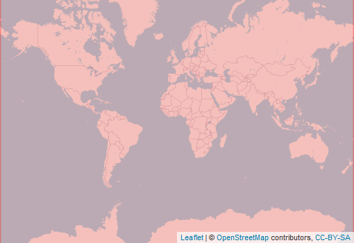

  
```{r setup, include=FALSE}
knitr::opts_chunk$set(echo = FALSE)
```

<div style="width=80%;margin-top:0;margin-bottom:0;">
<h3 style="margin-top:5;margin-bottom:5;">Details</h3>
<p align="justify">
The present-day map is derived from an ensemble of four high-resolution, topographically-corrected climatic maps. The future map is derived from an ensemble of 32 climate model projections (scenario RCP8.5), by superimposing the projected climate change anomaly on the baseline high-resolution climatic maps. For both time periods we calculate confidence levels from the ensemble spread, providing valuable indications of the reliability of the classifications. The new maps exhibit a higher classification accuracy and substantially more detail than previous maps, particularly in regions with sharp spatial or elevation gradients.
</p>

<h3 style="margin-top:5;margin-bottom:5;">Subdatasets</h3>
<details style='cursor:pointer;border:none;box-shadow: rgba(0, 0, 0, 0.05) 0px 6px 24px 0px, rgba(0, 0, 0, 0.08) 0px 0px 0px 1px;padding:10px;margin:0;'>
<summary style="font-size:16px;">`presentClass`<span style="color:#C8C8C8;"> | </span>Present climate (1980-2016)</summary>
<hr style="margin-top:0;margin-bottom:20px;">
|content|description|
|-------|-----------|
|1|Tropical, rainforest (Af)|
|2|Tropical, monsoon (Am)|
|3|Tropical, savannah (Aw)|
|4|Arid, desert, hot (BWh)|
|5|Arid, desert, cold (BWk)|
|6|Arid, steppe, hot (BSh)|
|7|Arid, steppe, cold (BSk)|
|8|Temperate, dry summer, hot summer (Csa)|
|9|Temperate, dry summer, warm summer (Csb)|
|10|Temperate, dry summer, cold summer (Csc)|
|11|Temperate, dry winter, hot summer (Cwa)|
|12|Temperate, dry winter, warm summer (Cwb)|
|13|Temperate, dry winter, cold summer (Cwc)|
|14|Temperate, no dry season, hot summer (Cfa)|
|15|Temperate, no dry season, warm summer (Cfb)|
|16|Temperate, no dry season, cold summer (Cfc)|
|17|Cold, dry summer, hot summer (Dsa)|
|18|Cold, dry summer, warm summer (Dsb)|
|19|Cold, dry summer, cold summer (Dsc)|
|20|Cold, dry summer, very cold winter (Dsd)|
|21|Cold, dry winter, hot summer (Dwa)|
|22|Cold, dry winter, warm summer (Dwb)|
|23|Cold, dry winter, cold summer (Dwc)|
|24|Cold, dry winter, very cold winter (Dwd)|
|25|Cold, no dry season, hot summer (Dfa)|
|26|Cold, no dry season, warm summer (Dfb)|
|27|Cold, no dry season, cold summer (Dfc)|
|28|Cold, no dry season, very cold winter (Dfd)|
|29|Polar, tundra (ET)|
|30|Polar, frost (EF)|
</details>
<details style='cursor:pointer;border:none;box-shadow: rgba(0, 0, 0, 0.05) 0px 6px 24px 0px, rgba(0, 0, 0, 0.08) 0px 0px 0px 1px;padding:10px;margin:0;'>
<summary style="font-size:16px;">`futureClass`<span style="color:#C8C8C8;"> | </span>Present climate (2006-2100)</summary>
<hr style="margin-top:0;margin-bottom:20px;">
|content|description|
|-------|-----------|
|1|Tropical, rainforest (Af)|
|2|Tropical, monsoon (Am)|
|3|Tropical, savannah (Aw)|
|4|Arid, desert, hot (BWh)|
|5|Arid, desert, cold (BWk)|
|6|Arid, steppe, hot (BSh)|
|7|Arid, steppe, cold (BSk)|
|8|Temperate, dry summer, hot summer (Csa)|
|9|Temperate, dry summer, warm summer (Csb)|
|10|Temperate, dry summer, cold summer (Csc)|
|11|Temperate, dry winter, hot summer (Cwa)|
|12|Temperate, dry winter, warm summer (Cwb)|
|13|Temperate, dry winter, cold summer (Cwc)|
|14|Temperate, no dry season, hot summer (Cfa)|
|15|Temperate, no dry season, warm summer (Cfb)|
|16|Temperate, no dry season, cold summer (Cfc)|
|17|Cold, dry summer, hot summer (Dsa)|
|18|Cold, dry summer, warm summer (Dsb)|
|19|Cold, dry summer, cold summer (Dsc)|
|20|Cold, dry summer, very cold winter (Dsd)|
|21|Cold, dry winter, hot summer (Dwa)|
|22|Cold, dry winter, warm summer (Dwb)|
|23|Cold, dry winter, cold summer (Dwc)|
|24|Cold, dry winter, very cold winter (Dwd)|
|25|Cold, no dry season, hot summer (Dfa)|
|26|Cold, no dry season, warm summer (Dfb)|
|27|Cold, no dry season, cold summer (Dfc)|
|28|Cold, no dry season, very cold winter (Dfd)|
|29|Polar, tundra (ET)|
|30|Polar, frost (EF)|
</details>
<details style='cursor:pointer;border:none;box-shadow: rgba(0, 0, 0, 0.05) 0px 6px 24px 0px, rgba(0, 0, 0, 0.08) 0px 0px 0px 1px;padding:10px;margin:0;'>
<summary style="font-size:16px;">`presentConfidence`<span style="color:#C8C8C8;"> | </span>Per-pixel confidence on the climate type of "presentClass"</summary>
<hr style="margin-top:0;margin-bottom:20px;">
|content|description|
|-------|-----------|
|value_range|0...100|
</details>
<details style='cursor:pointer;border:none;box-shadow: rgba(0, 0, 0, 0.05) 0px 6px 24px 0px, rgba(0, 0, 0, 0.08) 0px 0px 0px 1px;padding:10px;margin:0;'>
<summary style="font-size:16px;">`futureConfidence`<span style="color:#C8C8C8;"> | </span>Per-pixel confidence on the climate type of "futureClass"</summary>
<hr style="margin-top:0;margin-bottom:20px;">
|content|description|
|-------|-----------|
|value_range|0...100|
</details>
<h3 style="margin-top:5;margin-bottom:5;">masDMT query</h3>
<div style="width=80%;margin-top:5;margin-bottom:5;background-color:#777777;">
```{r eval=FALSE, echo=TRUE}
# data call without specifying subdataset and resolution
list_data("BECK_climateMap")

# data call for specific subdataset 
list_data("BECK_climateMap/presentClass")

# data call to subdataset with a specific resolution
list_data("BECK_climateMap/presentClass/1km")
```
</div>
<hr style="margin-top:0;margin-bottom:0;">
<h3 style="margin-bottom:0;">References</h3>
<p style='margin-top:0;margin-bottom:5;'>
             <a target='_blank' href='https://raw.githubusercontent.com/data-catalog/main/_posts/BECK_climateMap/BECK_climateMap.bib' download='BECK_climateMap/BECK_climateMap.bibtex'><small>(bibtex)</small></a></p>
[1] Beck, Zimmermann, McVicar, Vergopolan, Berg, and Wood (2018)
<hr>
</div>

<aside>
<p style="padding:5px;margin-top:0;margin-bottom:20px;border-radius:10px;text-align:center;background:#228B22;color:#ffffff;height:25px;width:70px;box-shadow: rgba(9, 30, 66, 0.25) 0px 4px 8px -2px, rgba(9, 30, 66, 0.08) 0px 0px 0px 1px;">available</p>
<hr style="margin-top:0;margin-bottom:0;">
<p style="margin-top:0;margin-bottom:0;">**Format**</p>
<p style="margin-top:0;">Grid</p>
<p style="margin-top:0;">**Spatial extent:**</p>

<p style="margin-top:0;margin-bottom:0;">**Temporal frequency:**</p>
<p style="margin-top:0;">Multiyear snapshot</p>
<p style="margin-top:0;margin-bottom:0;">**Resolution**</p>
<p style="margin-top:0;">1 km</p>
<p style="margin-top:0;margin-bottom:0;">**Time frame**</p>
<p style="margin-top:0;">1986 to 2100</p>
<hr style="margin-top:0;margin-bottom:0;">
<p><p style='margin-top:0;margin-bottom:0;'><a style='margin:0;padding:0;' href='https://www.nature.com/articles/sdata2018214'>documentation</a></p></p>
<p><p style='margin-top:0;margin-bottom:0;'><a style='margin:0;padding:0;' href='http://www.gloh2o.org/koppen/'>Data access</a></p></p>
<hr style="margin-top:0;margin-bottom:0;">
<p style="margin-top:0;margin-bottom:0;">**license:**</p>
<p style="margin-top:0;">CC-BY-SA-4.0</p>
<p style="margin-top:0;margin-bottom:0;">**Version**</p>
<p style="margin-top:0;">1</p>
<br>
<br>

<br>
<br>
<p style="margin-bottom:0;padding:0;">**Where there  mistakes?**</p>
<p><a href='https://github.com/macroecology-society/data-catalog/tree/main/_posts/BECK_climateMap/BECK_climateMap.yml'>Propose an edit at our GitHub repository</a></p>
</aside>
