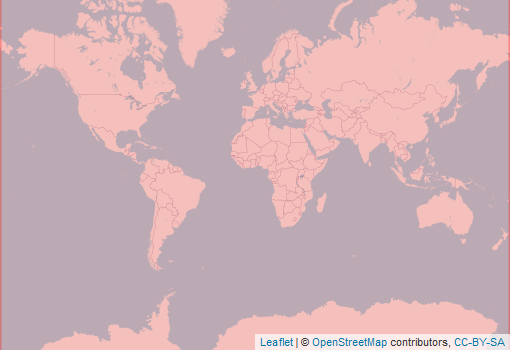

  
```{r setup, include=FALSE}
knitr::opts_chunk$set(echo = FALSE)
```

<div style="width=80%;margin-top:0;margin-bottom:0;">
<h3 style="margin-top:5;margin-bottom:5;">Details</h3>
<p align="justify">
This dataset provides a global map of bathymetric, expressing the depth of the ocean on a pixel-by-pixel basis, as well as land surface elevation.
</p>

<h3 style="margin-top:5;margin-bottom:5;">Subdatasets</h3>
<details style='cursor:pointer;border:none;box-shadow: rgba(0, 0, 0, 0.05) 0px 6px 24px 0px, rgba(0, 0, 0, 0.08) 0px 0px 0px 1px;padding:10px;margin:0;'>
<summary style="font-size:16px;">`bathymetry`<span style="color:#C8C8C8;"> | </span>OCean bathymetry</summary>
<hr style="margin-top:0;margin-bottom:20px;">
|content|description|
|-------|-----------|
|value_range|-n...n|
</details>
<h3 style="margin-top:5;margin-bottom:5;">masDMT query</h3>
<div style="width=80%;margin-top:5;margin-bottom:5;background-color:#777777;">
```{r eval=FALSE, echo=TRUE}
# data call without specifying subdataset and resolution
list_data("GEBCO")

# data call for specific subdataset 
list_data("GEBCO/bathymetry")

# data call to subdataset with a specific resolution
list_data("GEBCO/bathymetry/500m")
```
</div>
<hr style="margin-top:0;margin-bottom:0;">
<h3 style="margin-bottom:0;">References</h3>
<p style='margin-top:0;margin-bottom:5;'>
             <a target='_blank' href='https://raw.githubusercontent.com/data-catalog/main/_posts/GEBCO/GEBCO.bib' download='GEBCO/GEBCO.bibtex'><small>(bibtex)</small></a></p>
<p>[1] Jakobsson, Mayer, Bringensparr, Castro, Mohammad, Johnson, Ketter, Accettella, Amblas, An, Arndt, Canals, Casamor, Chauché, Coakley, Danielson, Demarte, Dickson, Dorschel, Dowdeswell, Dreutter, Fremand, Gallant, Hall, Hehemann, Hodnesdal, Hong, Ivaldi, Kane, Klaucke, Krawczyk, Kristoffersen, Kuipers, Millan, Masetti, Morlighem, Noormets, Prescott, Rebesco, Rignot, Semiletov, Tate, Travaglini, Velicogna, Weatherall, Weinrebe, Willis, Wood, Zarayskaya, Zhang, Zimmermann, and Zinglersen (2020)</p>
<hr>
</div>

<aside>
<p style="padding:5px;margin-top:0;margin-bottom:20px;border-radius:10px;text-align:center;background:#228B22;color:#ffffff;height:25px;width:70px;box-shadow: rgba(9, 30, 66, 0.25) 0px 4px 8px -2px, rgba(9, 30, 66, 0.08) 0px 0px 0px 1px;">available</p>
<hr style="margin-top:0;margin-bottom:0;">
<p style="margin-top:0;margin-bottom:0;">**Format**</p>
<p style="margin-top:0;">Grid</p>
<p style="margin-top:0;">**Spatial extent:**</p>

<p style="margin-top:0;margin-bottom:0;">**Temporal frequency:**</p>
<p style="margin-top:0;">NA</p>
<p style="margin-top:0;margin-bottom:0;">**Resolution**</p>
<p style="margin-top:0;">500 m</p>
<p style="margin-top:0;margin-bottom:0;">**Time frame**</p>
<p style="margin-top:0;">2021 to 2021</p>
<hr style="margin-top:0;margin-bottom:0;">
<p><p style='margin-top:0;margin-bottom:0;'><a style="margin:0;padding:0;" href="mailto:carsten.meyer@idiv.de?subject=Data information request: ">documentation</a></p></p>
<p><p style='margin-top:0;margin-bottom:0;'><a style="margin:0;padding:0;" href="mailto:carsten.meyer@idiv.de?subject=Data access request: ">Data access</a></p></p>
<hr style="margin-top:0;margin-bottom:0;">
<p style="margin-top:0;margin-bottom:0;">**license:**</p>
<p style="margin-top:0;">CC-BY-SA-4.0</p>
<p style="margin-top:0;margin-bottom:0;">**Version**</p>
<p style="margin-top:0;">2</p>
<br>
<br>

<br>
<br>
<p style="margin-bottom:0;padding:0;">**Where there  mistakes?**</p>
<p><a href='https://github.com/macroecology-society/data-catalog/tree/main/_posts/GEBCO/GEBCO.yml'>Propose an edit at our GitHub repository</a></p>
</aside>
