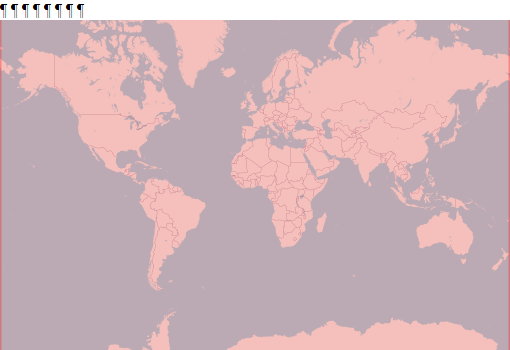

  
```{r setup, include=FALSE}
knitr::opts_chunk$set(echo = FALSE)
```

<div style="width=80%;margin-top:0;margin-bottom:0;">
<h3 style="margin-top:5;margin-bottom:5;">Details</h3>
<p align="justify">
This dataset offers different classifications of mountains following different definitions. The K1 resource used a 1 km DEM which was processed using a combination of elevation, slope and relative relief. Relative relief, or ruggedness, is the difference between maximum and minimum elevation in a moving neighborhood analysis window (NAW) and is computed for every raster cell. The K1 layer defined six classes of mountains, where the upper three classes were defined by elevation ranges. The lower three classes were defined either by a combination of elevation and slope, or elevation and relative relief. The circular NAW for computing the relative relief used a 5 pixel (~7 km) radius for an approximate NAW size of 150 km2. The K2 resource was developed using ruggedness as the determining factor, where any relative relief greater than 200m in the NAW was considered mountainous. The original K2 resource used a 1 km DEM and an approximately 9km2 NAW to determine relative relief and then generalized the relative relief surface to an approximately 4.5 km grid (at the equator). The K3 resource was developed using a finer spatial resolution (250 m) DEM and feature-based extraction algorithms with variable NAW sizes used to extract a set of global Hammond landforms with 16 landform types, of which four were mountain classes. E. H. Hammond was a pioneer of landform mapping and described three parameters for distinguishing different types of plains, hills, mountains, and tablelands. The three classification parameters are slope, relative relief, and profile, where the profile parameter assesses the amount of relatively flat terrain in upland locations to delineate tablelands. The 250 m global Hammond landforms product was based on an automated extraction of classes in a GIS environment, and the K3 mountains product was an export of the four mountain classes into a global mountains datalayer.
</p>

<h3 style="margin-top:5;margin-bottom:5;">Subdatasets</h3>
<details style='cursor:pointer;border:none;box-shadow: rgba(0, 0, 0, 0.05) 0px 6px 24px 0px, rgba(0, 0, 0, 0.08) 0px 0px 0px 1px;padding:10px;margin:0;'>
<summary style="font-size:16px;">`k1Class`<span style="color:#C8C8C8;"> | </span>K1 mountain classification</summary>
<hr style="margin-top:0;margin-bottom:20px;">
|content|description|
|-------|-----------|
|1|Elev >= 4500m|
|2|4500m > Elev >= 3500m|
|3|3500m > Elev >= 2500m|
|4|2500m > Elev >= 1500m & Slope > 2|
|5|1500m > Elev >= 1000m & Slope >= 5 OR LER > 300m|
|6|1000m > Elev >= 300m & LER > 300m|
|7|Inner Isolated Areas|
</details>
<details style='cursor:pointer;border:none;box-shadow: rgba(0, 0, 0, 0.05) 0px 6px 24px 0px, rgba(0, 0, 0, 0.08) 0px 0px 0px 1px;padding:10px;margin:0;'>
<summary style="font-size:16px;">`k2Class`<span style="color:#C8C8C8;"> | </span>K2 mountain classification</summary>
<hr style="margin-top:0;margin-bottom:20px;">
|content|description|
|-------|-----------|
|1|Nival|
|2|Upper alpine|
|3|Lower alpine|
|4|Upper montane|
|5|Lower montane|
|6|Remaining mountain area with frost|
|7|Remaining mountain area without frost|
</details>
<details style='cursor:pointer;border:none;box-shadow: rgba(0, 0, 0, 0.05) 0px 6px 24px 0px, rgba(0, 0, 0, 0.08) 0px 0px 0px 1px;padding:10px;margin:0;'>
<summary style="font-size:16px;">`k3Class`<span style="color:#C8C8C8;"> | </span>K3 mountain classification</summary>
<hr style="margin-top:0;margin-bottom:20px;">
|content|description|
|-------|-----------|
|1|High mountains|
|2|Scattered high mountains|
|3|Low mountains|
|4|Scattered low mountains|
</details>
<h3 style="margin-top:5;margin-bottom:5;">masDMT query</h3>
<div style="width=80%;margin-top:5;margin-bottom:5;background-color:#777777;">
```{r eval=FALSE, echo=TRUE}
# data call without specifying subdataset and resolution
list_data("GME")

# data call for specific subdataset 
list_data("GME/k1Class")

# data call to subdataset with a specific resolution
list_data("GME/k1Class/300m")
```
</div>
<hr style="margin-top:0;margin-bottom:0;">
<h3 style="margin-bottom:0;">References</h3>
<p style='margin-top:0;margin-bottom:5;'>
             <a target='_blank' href='https://raw.githubusercontent.com/data-catalog/main/_posts/GME/GME.bib' download='GME/GME.bibtex'><small>(bibtex)</small></a></p>
[1] Körner, Jetz, Paulsen, et al. (2017)
[2] Körner, Paulsen, and Spehn (2011)
[3] Karagulle, Frye, Sayre, Breyer, Aniello, Vaughan, and Wright (2017)
<hr>
</div>

<aside>
<p style="padding:5px;margin-top:0;margin-bottom:20px;border-radius:10px;text-align:center;background:#228B22;color:#ffffff;height:25px;width:70px;box-shadow: rgba(9, 30, 66, 0.25) 0px 4px 8px -2px, rgba(9, 30, 66, 0.08) 0px 0px 0px 1px;">available</p>
<hr style="margin-top:0;margin-bottom:0;">
<p style="margin-top:0;margin-bottom:0;">**Format**</p>
<p style="margin-top:0;">Grid</p>
<p style="margin-top:0;">**Spatial extent:**</p>

<p style="margin-top:0;margin-bottom:0;">**Temporal frequency:**</p>
<p style="margin-top:0;">Snapshot</p>
<p style="margin-top:0;margin-bottom:0;">**Resolution**</p>
<p style="margin-top:0;">300 m</p>
<p style="margin-top:0;margin-bottom:0;">**Time frame**</p>
<p style="margin-top:0;">2000 to 2017</p>
<hr style="margin-top:0;margin-bottom:0;">
<p><p style='margin-top:0;margin-bottom:0;'><a style='margin:0;padding:0;' href='https://rmgsc.cr.usgs.gov/gme/'>documentation</a></p></p>
<p><p style='margin-top:0;margin-bottom:0;'><a style='margin:0;padding:0;' href='https://rmgsc.cr.usgs.gov/gme/'>Data access</a></p></p>
<hr style="margin-top:0;margin-bottom:0;">
<p style="margin-top:0;margin-bottom:0;">**license:**</p>
<p style="margin-top:0;">CC-BY-SA-4.0</p>
<p style="margin-top:0;margin-bottom:0;">**Version**</p>
<p style="margin-top:0;">2</p>
<br>
<br>

<br>
<br>
<p style="margin-bottom:0;padding:0;">**Where there  mistakes?**</p>
<p><a href='https://github.com/macroecology-society/data-catalog/tree/main/_posts/GME/GME.yml'>Propose an edit at our GitHub repository</a></p>
</aside>
