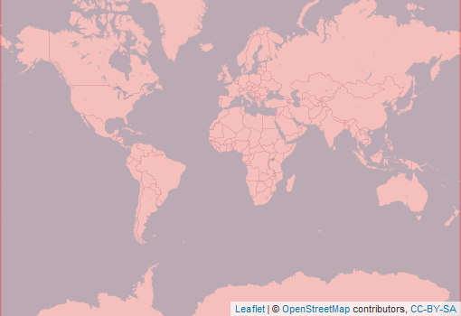

  
```{r setup, include=FALSE}
knitr::opts_chunk$set(echo = FALSE)
```

<div style="width=80%;margin-top:0;margin-bottom:0;">
<h3 style="margin-top:5;margin-bottom:5;">Details</h3>
<p align="justify">
HydroBASINS offers spatial data on watershed boundaries at multiple hierarchical levels. The watershed deliniation follows the topological concept of the Pfafstetter coding system (levels 1-12). Here, we use only a subset of the afformentioned dataset, comprising Pfafstetter levels 2, 3, and 12.
</p>

<h3 style="margin-top:5;margin-bottom:5;">Subdatasets</h3>
<details style='cursor:pointer;border:none;box-shadow: rgba(0, 0, 0, 0.05) 0px 6px 24px 0px, rgba(0, 0, 0, 0.08) 0px 0px 0px 1px;padding:10px;margin:0;'>
<summary style="font-size:16px;">`level2`<span style="color:#C8C8C8;"> | </span>Sub-continental basins</summary>
<hr style="margin-top:0;margin-bottom:20px;">
|content|description|
|-------|-----------|
|HYBAS_ID|Unique basin identifier|
|EXT_DOWN|Hybas_id of the next downstream polygon|
|NEXT_SINK|Hybas_id of the next downstream sink|
|MAIN_BAS|Hybas_id of the most downstream sink, i.e. the outlet of the main river basin|
|DIST_SINK|Distance from polygon outlet to the next downstream sink along the river network, in kilometers|
|DIST_MAIN|Distance from polygon outlet to the most downstream sink, i.e. the outlet of the main river basin along the river network, in kilometers|
|SUB_AREA|Area of the individual polygon (i.e. sub-basin), in square kilometers|
|UP_AREA|Total upstream area, in square kilometers|
|PFAF_ID|Pfafstetter code|
|SIDE|Indicates the side of a sub-basin in relation to the river network|
|LAKE|Indicator for lake types|
|ENDO|Indicator for endorheic (inland) basins without surface flow connection to the ocean|
|COAST|Indicator for lumped coastal basins|
|ORDER|Indicator of river order (classical ordering system)|
|SORT|Indicator showing the record number (sequence) in which the original polygons are stored in the shapefile|
</details>
<details style='cursor:pointer;border:none;box-shadow: rgba(0, 0, 0, 0.05) 0px 6px 24px 0px, rgba(0, 0, 0, 0.08) 0px 0px 0px 1px;padding:10px;margin:0;'>
<summary style="font-size:16px;">`level3`<span style="color:#C8C8C8;"> | </span>Basins of major rivers and lakes</summary>
<hr style="margin-top:0;margin-bottom:20px;">
|content|description|
|-------|-----------|
|HYBAS_ID|Unique basin identifier|
|EXT_DOWN|Hybas_id of the next downstream polygon|
|NEXT_SINK|Hybas_id of the next downstream sink|
|MAIN_BAS|Hybas_id of the most downstream sink, i.e. the outlet of the main river basin|
|DIST_SINK|Distance from polygon outlet to the next downstream sink along the river network, in kilometers|
|DIST_MAIN|Distance from polygon outlet to the most downstream sink, i.e. the outlet of the main river basin along the river network, in kilometers|
|SUB_AREA|Area of the individual polygon (i.e. sub-basin), in square kilometers|
|UP_AREA|Total upstream area, in square kilometers|
|PFAF_ID|Pfafstetter code|
|SIDE|Indicates the side of a sub-basin in relation to the river network|
|LAKE|Indicator for lake types|
|ENDO|Indicator for endorheic (inland) basins without surface flow connection to the ocean|
|COAST|Indicator for lumped coastal basins|
|ORDER|Indicator of river order (classical ordering system)|
|SORT|Indicator showing the record number (sequence) in which the original polygons are stored in the shapefile|
</details>
<details style='cursor:pointer;border:none;box-shadow: rgba(0, 0, 0, 0.05) 0px 6px 24px 0px, rgba(0, 0, 0, 0.08) 0px 0px 0px 1px;padding:10px;margin:0;'>
<summary style="font-size:16px;">`level12`<span style="color:#C8C8C8;"> | </span>Fine-scale basin subdivisions</summary>
<hr style="margin-top:0;margin-bottom:20px;">
|content|description|
|-------|-----------|
|HYBAS_ID|Unique basin identifier|
|EXT_DOWN|Hybas_id of the next downstream polygon|
|NEXT_SINK|Hybas_id of the next downstream sink|
|MAIN_BAS|Hybas_id of the most downstream sink, i.e. the outlet of the main river basin|
|DIST_SINK|Distance from polygon outlet to the next downstream sink along the river network, in kilometers|
|DIST_MAIN|Distance from polygon outlet to the most downstream sink, i.e. the outlet of the main river basin along the river network, in kilometers|
|SUB_AREA|Area of the individual polygon (i.e. sub-basin), in square kilometers|
|UP_AREA|Total upstream area, in square kilometers|
|PFAF_ID|Pfafstetter code|
|SIDE|Indicates the side of a sub-basin in relation to the river network|
|LAKE|Indicator for lake types|
|ENDO|Indicator for endorheic (inland) basins without surface flow connection to the ocean|
|COAST|Indicator for lumped coastal basins|
|ORDER|Indicator of river order (classical ordering system)|
|SORT|Indicator showing the record number (sequence) in which the original polygons are stored in the shapefile|
</details>
<h3 style="margin-top:5;margin-bottom:5;">masDMT query</h3>
<div style="width=80%;margin-top:5;margin-bottom:5;background-color:#777777;">
```{r eval=FALSE, echo=TRUE}
# data call without specifying subdataset and resolution
list_data("HydroSHEDS")

# data call for specific subdataset 
list_data("HydroSHEDS/level2")

# data call to subdataset with a specific resolution
list_data("HydroSHEDS/level2/500m")
```
</div>
<hr style="margin-top:0;margin-bottom:0;">
<h3 style="margin-bottom:0;">References</h3>
<p style='margin-top:0;margin-bottom:5;'>
             <a target='_blank' href='https://raw.githubusercontent.com/data-catalog/main/_posts/HydroSHEDS/HydroSHEDS.bib' download='HydroSHEDS/HydroSHEDS.bibtex'><small>(bibtex)</small></a></p>
[1] Lehner and Grill (2013)
<hr>
</div>

<aside>
<p style="padding:5px;margin-top:0;margin-bottom:20px;border-radius:10px;text-align:center;background:#228B22;color:#ffffff;height:25px;width:70px;box-shadow: rgba(9, 30, 66, 0.25) 0px 4px 8px -2px, rgba(9, 30, 66, 0.08) 0px 0px 0px 1px;">available</p>
<hr style="margin-top:0;margin-bottom:0;">
<p style="margin-top:0;margin-bottom:0;">**Format**</p>
<p style="margin-top:0;">Vector</p>
<p style="margin-top:0;">**Spatial extent:**</p>

<p style="margin-top:0;margin-bottom:0;">**Temporal frequency:**</p>
<p style="margin-top:0;">Multiyear snapshot</p>
<p style="margin-top:0;margin-bottom:0;">**Resolution**</p>
<p style="margin-top:0;">500 m</p>
<p style="margin-top:0;margin-bottom:0;">**Time frame**</p>
<p style="margin-top:0;">2013 to NA</p>
<hr style="margin-top:0;margin-bottom:0;">
<p><p style='margin-top:0;margin-bottom:0;'><a style='margin:0;padding:0;' href='https://www.hydrosheds.org/page/hydrobasins'>documentation</a></p></p>
<p><p style='margin-top:0;margin-bottom:0;'><a style='margin:0;padding:0;' href='https://www.hydrosheds.org/page/hydrobasins'>Data access</a></p></p>
<hr style="margin-top:0;margin-bottom:0;">
<p style="margin-top:0;margin-bottom:0;">**license:**</p>
<p style="margin-top:0;">CC-BY-SA-4.0</p>
<p style="margin-top:0;margin-bottom:0;">**Version**</p>
<p style="margin-top:0;">1</p>
<br>
<br>

<br>
<br>
<p style="margin-bottom:0;padding:0;">**Where there  mistakes?**</p>
<p><a href='https://github.com/macroecology-society/data-catalog/tree/main/_posts/HydroSHEDS/HydroSHEDS.yml'>Propose an edit at our GitHub repository</a></p>
</aside>
