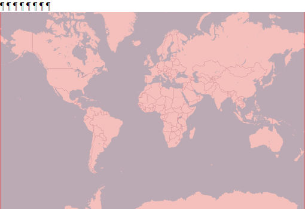

  
```{r setup, include=FALSE}
knitr::opts_chunk$set(echo = FALSE)
```

<div style="width=80%;margin-top:0;margin-bottom:0;">
<h3 style="margin-top:5;margin-bottom:5;">Details</h3>
<p align="justify">
This dataset provides per-pixel information on the frequency and quality of Landsat acquisitions between 1982 and 2020. For each year, we counted the number of acquisitions and evaluated the intra-annual acqusition quality. The closer the quality metric is in value to the acquisition frequency, the better the quality of the satellite images. In addition, this dataset provides a quality index, which is the quotient between the image quality metric and the acquisition frequency. The closest the output is to 1, the highest the quality of the imagery in the given year.
</p>

<h3 style="margin-top:5;margin-bottom:5;">Subdatasets</h3>
<details style='cursor:pointer;border:none;box-shadow: rgba(0, 0, 0, 0.05) 0px 6px 24px 0px, rgba(0, 0, 0, 0.08) 0px 0px 0px 1px;padding:10px;margin:0;'>
<summary style="font-size:16px;">`imageFrequency`<span style="color:#C8C8C8;"> | </span>Number of satellite acquisitions per pixel</summary>
<hr style="margin-top:0;margin-bottom:20px;">
|content|description|
|-------|-----------|
</details>
<details style='cursor:pointer;border:none;box-shadow: rgba(0, 0, 0, 0.05) 0px 6px 24px 0px, rgba(0, 0, 0, 0.08) 0px 0px 0px 1px;padding:10px;margin:0;'>
<summary style="font-size:16px;">`monthFrequency`<span style="color:#C8C8C8;"> | </span>Number of observed months</summary>
<hr style="margin-top:0;margin-bottom:20px;">
|content|description|
|-------|-----------|
</details>
<details style='cursor:pointer;border:none;box-shadow: rgba(0, 0, 0, 0.05) 0px 6px 24px 0px, rgba(0, 0, 0, 0.08) 0px 0px 0px 1px;padding:10px;margin:0;'>
<summary style="font-size:16px;">`quality`<span style="color:#C8C8C8;"> | </span>Sum of quality weights per pixel</summary>
<hr style="margin-top:0;margin-bottom:20px;">
|content|description|
|-------|-----------|
|value_range|0...n|
</details>
<details style='cursor:pointer;border:none;box-shadow: rgba(0, 0, 0, 0.05) 0px 6px 24px 0px, rgba(0, 0, 0, 0.08) 0px 0px 0px 1px;padding:10px;margin:0;'>
<summary style="font-size:16px;">`distributionQuality`<span style="color:#C8C8C8;"> | </span>Maximum monthly data quality ('quality'/'imageFrequency')  divided by 12</summary>
<hr style="margin-top:0;margin-bottom:20px;">
|content|description|
|-------|-----------|
|value_range|0...1|
</details>
<details style='cursor:pointer;border:none;box-shadow: rgba(0, 0, 0, 0.05) 0px 6px 24px 0px, rgba(0, 0, 0, 0.08) 0px 0px 0px 1px;padding:10px;margin:0;'>
<summary style="font-size:16px;">`nrTiles`<span style="color:#C8C8C8;"> | </span>Number of tiles contribution with acquisitions</summary>
<hr style="margin-top:0;margin-bottom:20px;">
|content|description|
|-------|-----------|
|value_range|0...n|
</details>
<h3 style="margin-top:5;margin-bottom:5;">masDMT query</h3>
<div style="width=80%;margin-top:5;margin-bottom:5;background-color:#777777;">
```{r eval=FALSE, echo=TRUE}
# data call without specifying subdataset and resolution
list_data("LTQA")

# data call for specific subdataset 
list_data("LTQA/imageFrequency")

# data call to subdataset with a specific resolution
list_data("LTQA/imageFrequency/1km")
```
</div>
<hr style="margin-top:0;margin-bottom:0;">

<hr>
</div>

<aside>
<p style="padding:5px;margin-top:0;margin-bottom:20px;border-radius:10px;text-align:center;background:#228B22;color:#ffffff;height:25px;width:70px;box-shadow: rgba(9, 30, 66, 0.25) 0px 4px 8px -2px, rgba(9, 30, 66, 0.08) 0px 0px 0px 1px;">available</p>
<hr style="margin-top:0;margin-bottom:0;">
<p style="margin-top:0;margin-bottom:0;">**Format**</p>
<p style="margin-top:0;">Grid</p>
<p style="margin-top:0;">**Spatial extent:**</p>

<p style="margin-top:0;margin-bottom:0;">**Temporal frequency:**</p>
<p style="margin-top:0;">Yearly</p>
<p style="margin-top:0;margin-bottom:0;">**Resolution**</p>
<p style="margin-top:0;">1 km</p>
<p style="margin-top:0;margin-bottom:0;">**Time frame**</p>
<p style="margin-top:0;">1982 to 2020</p>
<hr style="margin-top:0;margin-bottom:0;">
<p><p style='margin-top:0;margin-bottom:0;'><a style="margin:0;padding:0;" href="mailto:mas@idiv.de?subject=Data information request: ">documentation</a></p></p>
<p><p style='margin-top:0;margin-bottom:0;'><a style="margin:0;padding:0;" href="mailto:mas@idiv.de?subject=Data access request: ">Data access</a></p></p>
<hr style="margin-top:0;margin-bottom:0;">
<p style="margin-top:0;margin-bottom:0;">**license:**</p>
<p style="margin-top:0;">CC-BY-SA-4.0</p>
<p style="margin-top:0;margin-bottom:0;">**Version**</p>
<p style="margin-top:0;">1</p>
<br>
<br>

<br>
<br>
<p style="margin-bottom:0;padding:0;">**Where there  mistakes?**</p>
<p><a href='https://github.com/macroecology-society/data-catalog/tree/main/_posts/LTQA/LTQA.yml'>Propose an edit at our GitHub repository</a></p>
</aside>
