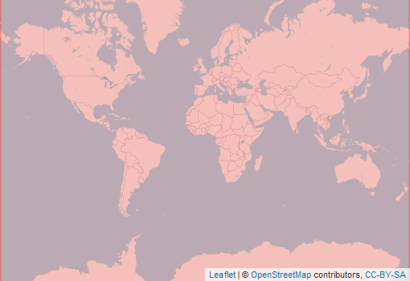

  
```{r setup, include=FALSE}
knitr::opts_chunk$set(echo = FALSE)
```

<div style="width=80%;margin-top:0;margin-bottom:0;">
<h3 style="margin-top:5;margin-bottom:5;">Details</h3>
<p align="justify">
This dataset provides yearly data on global, annual fire extents and prevailance. It uses data from MODIS MCD64A1 product to count the number of months with observed fires at each pixel within each year.
</p>

<h3 style="margin-top:5;margin-bottom:5;">Subdatasets</h3>
<details style='cursor:pointer;border: none;box-shadow: 3px 3px 4px #f8f8f8;'>
<summary style="font-size: 16px;">`nrMonths` | Number of burning months</summary>
|content|description|
|-------|-----------|
|value_range|0...12|
</details>
<h3 style="margin-top:5;margin-bottom:5;">masDMT query</h3>
<div style="width=80%;margin-top:5;margin-bottom:5;background-color:#777777;">
```{r eval=FALSE, echo=TRUE}
# data call without specifying subdataset and resolution
list_data("fireFrequency")

# data call for specific subdataset 
list_data("fireFrequency/nrMonths")

# data call to subdataset with a specific resolution
list_data("fireFrequency/nrMonths/1km")
```
</div>
<hr style="margin-top:0;margin-bottom:0;">
<h3 style="margin-bottom:0;">References</h3>
<p style='margin-top:0;margin-bottom:5;'><a href='https://github.com/macroecology-society/data-catalog/tree/main/_posts/fireFrequency/fireFrequency.bib download=fireFrequency/fireFrequency.bibtex'><small>(Download bibtex)</small></a></p>
[1] Giglio, Boschetti, Roy, Humber, and Justice (2018)
</div>

<aside>
<p style="margin-top:0;margin-bottom:0;">**Format**</p>
<p style="margin-top:0;">Grid</p>
<p style="margin-top:0;">**Spatial extent:**</p>

<p style="margin-top:0;margin-bottom:0;">**Temporal frequency:**</p>
<p style="margin-top:0;">Yearly</p>
<p style="margin-top:0;margin-bottom:0;">**Resolution**</p>
<p style="margin-top:0;">1 km</p>
<p style="margin-top:0;margin-bottom:0;">**Time frame**</p>
<p style="margin-top:0;">2001 to 2020</p>
<hr style="margin-top:0;margin-bottom:0;">
<p><p style='margin-top:0;margin-bottom:0;'><a style='margin:0;padding:0;' href='https://lpdaac.usgs.gov/products/mcd64a1v006/'>documentation.</a></p></p>
<p><p style='margin-top:0;margin-bottom:0;'><a style='margin:0;padding:0;' href='mailto:mas@idiv.de?Data information request: '>Data access</a></p></p>
<hr style="margin-top:0;margin-bottom:0;">
<p style="margin-top:0;margin-bottom:0;">**license:**</p>
<p style="margin-top:0;">CC-BY-SA-4.0</p>
<p style="margin-top:0;margin-bottom:0;">**Version**</p>
<p style="margin-top:0;">1</p>
<p style="margin-top:0;margin-bottom:0;border-radius:15px;vertical-align:middle;text-align:center;background:#229954;color:#ffffff;height:25px;width:70px;">available</p>
<br>
<br>

<br>
<br>
<p style="margin-bottom:0;padding:0;">**Where there  mistakes?**</p>
<p><a href='https://github.com/macroecology-society/data-catalog/tree/main/_posts/fireFrequency/fireFrequency.yml'>Propose an edit at our GitHub repository</a></p>
</aside>
