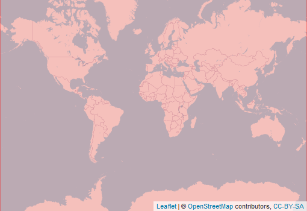

  
```{r setup, include=FALSE}
knitr::opts_chunk$set(echo = FALSE)
```

<div style="width=80%;margin-top:0;margin-bottom:0;">
<h3 style="margin-top:5;margin-bottom:5;">Details</h3>
<p align="justify">
This dataset fuses multiple remote sensing products derived from satellite with different spatial resolutions, such as Landsat, AVHRR, and Spot. This dataset extends on the time-series data from the Global Forest Change (GFC) dataset, which covers the period from 2000 to the present, using a spatially and temporally explicit machine learning algorithm. This method integrates coarse resolution data on vegetation dynamics, data on high and low-resoluton data on change dynamics, and high and mid-resolution data on land cover, to construct a consistent yearly forest density data product from 1992 to 2018 mapped with a 300-m resolution.
</p>

<h3 style="margin-top:5;margin-bottom:5;">Subdatasets</h3>
<details style='cursor:pointer;border: none;box-shadow: 3px 3px 4px #f8f8f8;'>
<summary style="font-size: 16px;">`forestDensity` | Per-pixel density of forest (%)</summary>
|content|description|
|-------|-----------|
|value_range|0...100|
</details>
<h3 style="margin-top:5;margin-bottom:5;">masDMT query</h3>
<div style="width=80%;margin-top:5;margin-bottom:5;background-color:#777777;">
```{r eval=FALSE, echo=TRUE}
# data call without specifying subdataset and resolution
list_data("iGFC")

# data call for specific subdataset 
list_data("iGFC/forestDensity")

# data call to subdataset with a specific resolution
list_data("iGFC/forestDensity/300m")
```
</div>
<hr style="margin-top:0;margin-bottom:0;">

</div>

<aside>
<p style="margin-top:0;margin-bottom:0;">**Format**</p>
<p style="margin-top:0;">Grid</p>
<p style="margin-top:0;">**Spatial extent:**</p>

<p style="margin-top:0;margin-bottom:0;">**Temporal frequency:**</p>
<p style="margin-top:0;">Yearly</p>
<p style="margin-top:0;margin-bottom:0;">**Resolution**</p>
<p style="margin-top:0;">300 m</p>
<p style="margin-top:0;margin-bottom:0;">**Time frame**</p>
<p style="margin-top:0;">1992 to 2018</p>
<hr style="margin-top:0;margin-bottom:0;">
<p><p style='margin-top:0;margin-bottom:0;'><a style='margin:0;padding:0;' href='mailto:mas@idiv.de?Data information request: '>documentation</a></p></p>
<p><p style='margin-top:0;margin-bottom:0;'><a style='margin:0;padding:0;' href='mailto:mas@idiv.de?Data information request: '>Data access</a></p></p>
<hr style="margin-top:0;margin-bottom:0;">
<p style="margin-top:0;margin-bottom:0;">**license:**</p>
<p style="margin-top:0;">CC-BY-SA-4.0</p>
<p style="margin-top:0;margin-bottom:0;">**Version**</p>
<p style="margin-top:0;">1</p>
<p style="margin-top:0;margin-bottom:0;border-radius:15px;vertical-align:middle;text-align:center;background:#229954;color:#ffffff;height:25px;width:70px;">available</p>
<br>
<br>

<br>
<br>
<p style="margin-bottom:0;padding:0;">**Where there  mistakes?**</p>
<p><a href='https://github.com/macroecology-society/data-catalog/tree/main/_posts/iGFC/iGFC.yml'>Propose an edit at our GitHub repository</a></p>
</aside>
