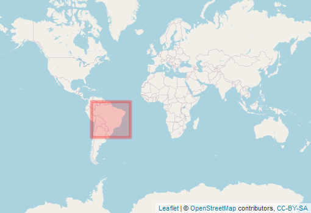

  
```{r setup, include=FALSE}
knitr::opts_chunk$set(echo = FALSE)
```

<div style="width=80%;margin-top:0;margin-bottom:0;">
<h3 style="margin-top:5;margin-bottom:5;">Details</h3>
<p align="justify">
This product belongs to the Brazilian Annual Land Use and Land Cover Mapping Project, producing the first annual, high-resolution land cover dataset of Brazil. It was derived through the classification of dense time-series of Landsat acquisitions, and mapped with a 30-m resolution.
</p>

<h3 style="margin-top:5;margin-bottom:5;">Subdatasets</h3>
<details style='cursor:pointer;border:none;box-shadow: rgba(0, 0, 0, 0.05) 0px 6px 24px 0px, rgba(0, 0, 0, 0.08) 0px 0px 0px 1px;padding:10px;margin:0;'>
<summary style="font-size:16px;">`amazonia`<span style="color:#C8C8C8;"> | </span>Land cover of the Amazonia region</summary>
<hr style="margin-top:0;margin-bottom:20px;">
|content|description|
|-------|-----------|
|1|Forest|
|3|Forest Formation|
|4|Savanna Formation|
|5|Mangrove|
|9|Forest Plantation|
|10|Non Forest Natural Formation|
|11|Wetlands|
|12|Grassland|
|13|Other non Forest Formations|
|14|Farming|
|15|Pasture|
|18|Agriculture|
|19|Temporary Crop|
|20|Sugar cane|
|21|Mosaic Agriculture and Pasture|
|22|Non vegetated Area|
|23|Beach, Dune and Sand Spot|
|24|Urban Area|
|25|Other non Vegetaded Areas|
|26|Water|
|27|Non Observed|
|29|Rocky Outcrop|
|30|Mining|
|31|Aquaculture|
|32|Salt Flat|
|33|River,Lake and Ocean|
|36|Perennial Corp|
|39|Soybean|
|40|Rice|
|41|Other temporary Crops|
|46|Coffee|
|47|Citrus|
|48|Other Perennial Crop|
|49|Wooded Restinga|
</details>
<details style='cursor:pointer;border:none;box-shadow: rgba(0, 0, 0, 0.05) 0px 6px 24px 0px, rgba(0, 0, 0, 0.08) 0px 0px 0px 1px;padding:10px;margin:0;'>
<summary style="font-size:16px;">`cerrado`<span style="color:#C8C8C8;"> | </span>Land cover of the Cerrado region</summary>
<hr style="margin-top:0;margin-bottom:20px;">
|content|description|
|-------|-----------|
|1|Forest|
|3|Forest Formation|
|4|Savanna Formation|
|5|Mangrove|
|9|Forest Plantation|
|10|Non Forest Natural Formation|
|11|Wetlands|
|12|Grassland|
|13|Other non Forest Formations|
|14|Farming|
|15|Pasture|
|18|Agriculture|
|19|Temporary Crop|
|20|Sugar cane|
|21|Mosaic Agriculture and Pasture|
|22|Non vegetated Area|
|23|Beach, Dune and Sand Spot|
|24|Urban Area|
|25|Other non Vegetaded Areas|
|26|Water|
|27|Non Observed|
|29|Rocky Outcrop|
|30|Mining|
|31|Aquaculture|
|32|Salt Flat|
|33|River,Lake and Ocean|
|36|Perennial Corp|
|39|Soybean|
|40|Rice|
|41|Other temporary Crops|
|46|Coffee|
|47|Citrus|
|48|Other Perennial Crop|
|49|Wooded Restinga|
</details>
<details style='cursor:pointer;border:none;box-shadow: rgba(0, 0, 0, 0.05) 0px 6px 24px 0px, rgba(0, 0, 0, 0.08) 0px 0px 0px 1px;padding:10px;margin:0;'>
<summary style="font-size:16px;">`pampa`<span style="color:#C8C8C8;"> | </span>Land cover of the Pampa region</summary>
<hr style="margin-top:0;margin-bottom:20px;">
|content|description|
|-------|-----------|
|1|Forest|
|3|Forest Formation|
|4|Savanna Formation|
|5|Mangrove|
|9|Forest Plantation|
|10|Non Forest Natural Formation|
|11|Wetlands|
|12|Grassland|
|13|Other non Forest Formations|
|14|Farming|
|15|Pasture|
|18|Agriculture|
|19|Temporary Crop|
|20|Sugar cane|
|21|Mosaic Agriculture and Pasture|
|22|Non vegetated Area|
|23|Beach, Dune and Sand Spot|
|24|Urban Area|
|25|Other non Vegetaded Areas|
|26|Water|
|27|Non Observed|
|29|Rocky Outcrop|
|30|Mining|
|31|Aquaculture|
|32|Salt Flat|
|33|River,Lake and Ocean|
|36|Perennial Corp|
|39|Soybean|
|40|Rice|
|41|Other temporary Crops|
|46|Coffee|
|47|Citrus|
|48|Other Perennial Crop|
|49|Wooded Restinga|
</details>
<details style='cursor:pointer;border:none;box-shadow: rgba(0, 0, 0, 0.05) 0px 6px 24px 0px, rgba(0, 0, 0, 0.08) 0px 0px 0px 1px;padding:10px;margin:0;'>
<summary style="font-size:16px;">`pantanal`<span style="color:#C8C8C8;"> | </span>Land cover of the Pantanal region</summary>
<hr style="margin-top:0;margin-bottom:20px;">
|content|description|
|-------|-----------|
|1|Forest|
|3|Forest Formation|
|4|Savanna Formation|
|5|Mangrove|
|9|Forest Plantation|
|10|Non Forest Natural Formation|
|11|Wetlands|
|12|Grassland|
|13|Other non Forest Formations|
|14|Farming|
|15|Pasture|
|18|Agriculture|
|19|Temporary Crop|
|20|Sugar cane|
|21|Mosaic Agriculture and Pasture|
|22|Non vegetated Area|
|23|Beach, Dune and Sand Spot|
|24|Urban Area|
|25|Other non Vegetaded Areas|
|26|Water|
|27|Non Observed|
|29|Rocky Outcrop|
|30|Mining|
|31|Aquaculture|
|32|Salt Flat|
|33|River,Lake and Ocean|
|36|Perennial Corp|
|39|Soybean|
|40|Rice|
|41|Other temporary Crops|
|46|Coffee|
|47|Citrus|
|48|Other Perennial Crop|
|49|Wooded Restinga|
</details>
<details style='cursor:pointer;border:none;box-shadow: rgba(0, 0, 0, 0.05) 0px 6px 24px 0px, rgba(0, 0, 0, 0.08) 0px 0px 0px 1px;padding:10px;margin:0;'>
<summary style="font-size:16px;">`mataatlantica`<span style="color:#C8C8C8;"> | </span>Land cover of the Mata Atlantica region</summary>
<hr style="margin-top:0;margin-bottom:20px;">
|content|description|
|-------|-----------|
|1|Forest|
|3|Forest Formation|
|4|Savanna Formation|
|5|Mangrove|
|9|Forest Plantation|
|10|Non Forest Natural Formation|
|11|Wetlands|
|12|Grassland|
|13|Other non Forest Formations|
|14|Farming|
|15|Pasture|
|18|Agriculture|
|19|Temporary Crop|
|20|Sugar cane|
|21|Mosaic Agriculture and Pasture|
|22|Non vegetated Area|
|23|Beach, Dune and Sand Spot|
|24|Urban Area|
|25|Other non Vegetaded Areas|
|26|Water|
|27|Non Observed|
|29|Rocky Outcrop|
|30|Mining|
|31|Aquaculture|
|32|Salt Flat|
|33|River,Lake and Ocean|
|36|Perennial Corp|
|39|Soybean|
|40|Rice|
|41|Other temporary Crops|
|46|Coffee|
|47|Citrus|
|48|Other Perennial Crop|
|49|Wooded Restinga|
</details>
<h3 style="margin-top:5;margin-bottom:5;">masDMT query</h3>
<div style="width=80%;margin-top:5;margin-bottom:5;background-color:#777777;">
```{r eval=FALSE, echo=TRUE}
# data call without specifying subdataset and resolution
list_data("mapBiomas")

# data call for specific subdataset 
list_data("mapBiomas/amazonia")

# data call to subdataset with a specific resolution
list_data("mapBiomas/amazonia/30m")
```
</div>
<hr style="margin-top:0;margin-bottom:0;">
<h3 style="margin-bottom:0;">References</h3>
<p style='margin-top:0;margin-bottom:5;'>
             <a target='_blank' href='https://raw.githubusercontent.com/data-catalog/main/_posts/mapBiomas/mapBiomas.bib' download='mapBiomas/mapBiomas.bibtex'><small>(bibtex)</small></a></p>
[1]  (2021)
<hr>
</div>

<aside>
<p style="padding:5px;margin-top:0;margin-bottom:20px;border-radius:10px;text-align:center;background:#228B22;color:#ffffff;height:25px;width:70px;box-shadow: rgba(9, 30, 66, 0.25) 0px 4px 8px -2px, rgba(9, 30, 66, 0.08) 0px 0px 0px 1px;">available</p>
<hr style="margin-top:0;margin-bottom:0;">
<p style="margin-top:0;margin-bottom:0;">**Format**</p>
<p style="margin-top:0;">Grid</p>
<p style="margin-top:0;">**Spatial extent:**</p>

<p style="margin-top:0;margin-bottom:0;">**Temporal frequency:**</p>
<p style="margin-top:0;">Yearly</p>
<p style="margin-top:0;margin-bottom:0;">**Resolution**</p>
<p style="margin-top:0;">30 m</p>
<p style="margin-top:0;margin-bottom:0;">**Time frame**</p>
<p style="margin-top:0;">1985 to 2020</p>
<hr style="margin-top:0;margin-bottom:0;">
<p><p style='margin-top:0;margin-bottom:0;'><a style='margin:0;padding:0;' href='https://mapbiomas.org/'>documentation</a></p></p>
<p><p style='margin-top:0;margin-bottom:0;'><a style='margin:0;padding:0;' href='https://mapbiomas.org/download'>Data access</a></p></p>
<hr style="margin-top:0;margin-bottom:0;">
<p style="margin-top:0;margin-bottom:0;">**license:**</p>
<p style="margin-top:0;">CC-BY-SA-4.0</p>
<p style="margin-top:0;margin-bottom:0;">**Version**</p>
<p style="margin-top:0;">4</p>
<br>
<br>

<br>
<br>
<p style="margin-bottom:0;padding:0;">**Where there  mistakes?**</p>
<p><a href='https://github.com/macroecology-society/data-catalog/tree/main/_posts/mapBiomas/mapBiomas.yml'>Propose an edit at our GitHub repository</a></p>
</aside>
